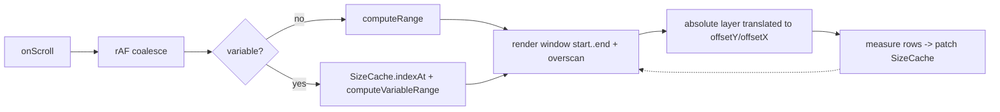

<p align="center">
  
</p>

<h1 align="center">react-virtualized-list</h1>

<p align="center">
  <strong>High-performance windowed list & grid for React — render only what's on screen.</strong><br>
  Variable heights, horizontal mode, sticky headers, scroll-to-index, and a pure windowing core.
</p>

<p align="center">
  <em>Built and maintained by <a href="https://viprasol.com">Viprasol Tech</a> — Fintech Experts. Full-Stack Builders.</em>
</p>

<p align="center">
  <a href="https://github.com/Viprasol-Tech/react-virtualized-list/actions/workflows/ci.yml"></a>
  <a href="LICENSE"></a>
  
  = 18">
  
  
  <a href="https://t.me/viprasol_help"></a>
</p>

---

## ✨ Features

- 🚀 **Blazing performance** — renders only the visible window + overscan, even for 100k+ rows.
- 📐 **Variable row heights** — fixed, per-index function, or auto-**measured** from real DOM.
- ↔️ **Horizontal mode** — virtualize along the X axis with `direction="horizontal"`.
- 📌 **Sticky header & footer** — pin chrome above/below the scrolled content.
- 🎯 **scrollToIndex / scrollToOffset** — imperative `ref` API with `start | center | end | auto` alignment.
- 🟦 **2D grid windowing** — `computeGridRange()` windows rows and columns independently.
- 🎚️ **Overscan tuning** — trade extra off-screen rows for smoother fast scrolls.
- ♿ **Accessible** — `role="list"`, `aria-rowcount`, per-row `aria-posinset` / `aria-setsize`.
- 🧮 **Pure windowing core** — `computeRange()`, `SizeCache`, and friends are React-free and fully tested.
- 🔒 **Strictly typed** — TypeScript `strict`, ships `.d.ts`, **zero runtime dependencies**.

## 📦 Install

```bash
npm install react-virtualized-list
```

> Peer deps: `react >= 18` and `react-dom >= 18`.

## 🚀 Usage

### Basic fixed-height list

```tsx
import { VirtualList } from "react-virtualized-list";

export function Demo() {
  const items = Array.from({ length: 100_000 }, (_, i) => `Row ${i}`);
  return (
    <VirtualList
      itemCount={items.length}
      itemHeight={32}
      height={400}
      overscan={4}
      renderItem={(index, style) => (
        <div style={style} key={index}>
          {items[index]}
        </div>
      )}
    />
  );
}
```

### Variable (measured) heights

```tsx
<VirtualList
  itemCount={rows.length}
  itemHeight={48}          // initial estimate
  estimatedItemHeight={48}
  measure                   // measure real DOM heights and adapt
  height={500}
  renderItem={(i, style) => (
    <div style={style} key={i}>
      {rows[i].body /* arbitrary tall/short content */}
    </div>
  )}
/>
```

### Scroll to an index imperatively

```tsx
import { useRef } from "react";
import { VirtualList, type VirtualListHandle } from "react-virtualized-list";

function Jumpable() {
  const ref = useRef<VirtualListHandle>(null);
  return (
    <>
      <button onClick={() => ref.current?.scrollToIndex(5000, "center")}>
        Jump to 5000
      </button>
      <VirtualList
        ref={ref}
        itemCount={10_000}
        itemHeight={24}
        height={400}
        renderItem={(i, style) => <div style={style} key={i}>Item {i}</div>}
      />
    </>
  );
}
```

### Horizontal + sticky header

```tsx
<VirtualList
  direction="horizontal"
  itemCount={1000}
  itemHeight={120}          // column width along the scroll axis
  height={200}              // viewport height (cross axis)
  stickyHeader={<Toolbar />}
  renderItem={(i, style) => <Card style={style} key={i} index={i} />}
/>
```

### Pure helpers (no component)

```ts
import { computeRange, SizeCache, computeGridRange } from "react-virtualized-list";

// Fixed-size windowing math.
computeRange(scrollTop, itemHeight, viewport, itemCount, overscan);

// Variable sizes with a prefix-sum cache (O(log n) pixel -> index).
const cache = new SizeCache(itemCount, /* estimate */ 40);
cache.setSize(3, 120);
cache.indexAt(scrollTop);

// 2D grid window.
computeGridRange({
  scrollTop, scrollLeft, rowHeight: 28, columnWidth: 120,
  viewportHeight: 400, viewportWidth: 800,
  rowCount: 5000, columnCount: 200, overscan: 2,
});
```

## 🧠 How it works



A single spacer establishes the full scrollable extent so the native scrollbar
is accurate. Only the windowed rows are mounted, absolutely positioned inside a
layer translated to the first row's offset. In `measure` mode, rendered rows are
measured after paint and their real sizes patched into the `SizeCache`.

## 📚 Props / API

### `<VirtualList>` props

| Prop                  | Type                                                | Default      | Description |
| --------------------- | --------------------------------------------------- | ------------ | ----------- |
| `itemCount`           | `number`                                            | —            | Total number of items. |
| `itemHeight`          | `number \| (index: number) => number`               | —            | Size along the scroll axis. Function enables variable sizing. |
| `height`              | `number`                                            | —            | Viewport size along the scroll axis (px). |
| `renderItem`          | `(index, style) => ReactNode`                       | —            | Row renderer. **Spread `style`** onto the row root. |
| `overscan`            | `number`                                            | `2`          | Extra rows rendered beyond the viewport. |
| `direction`           | `"vertical" \| "horizontal"`                        | `"vertical"` | Scroll/layout axis. |
| `measure`             | `boolean`                                            | `false`      | Measure real DOM sizes and adapt the size cache. |
| `estimatedItemHeight` | `number`                                             | `itemHeight` | Fallback size for unmeasured rows. |
| `stickyHeader`        | `ReactNode`                                          | —            | Pinned content above the scroll area. |
| `stickyFooter`        | `ReactNode`                                          | —            | Pinned content below the scroll area. |
| `onScrollOffsetChange`| `(offset: number) => void`                          | —            | Fires on scroll with the new offset. |
| `onRangeChange`       | `(range: VirtualRange) => void`                     | —            | Fires when the visible range changes. |
| `width`               | `number \| string`                                  | `"100%"`     | Cross-axis viewport size. |
| `role`                | `string`                                            | `"list"`     | ARIA role of the container. |
| `aria-label`          | `string`                                            | —            | Accessible name. |
| `className`           | `string`                                            | —            | Class on the scroll container. |
| `style`               | `CSSProperties`                                      | —            | Inline style merged onto the scroll container. |
| `data-testid`         | `string`                                            | —            | Forwarded to the scroll container. |

### `VirtualListHandle` (via `ref`)

| Method                                | Description |
| ------------------------------------- | ----------- |
| `scrollToIndex(index, align?)`        | Scroll so `index` is visible. `align`: `start \| center \| end \| auto`. |
| `scrollToOffset(offset)`              | Scroll to an absolute pixel offset. |
| `getScrollOffset()`                   | Current scroll offset along the axis. |
| `getScrollElement()`                  | The underlying scroll `<div>` (or `null`). |

### Exported helpers

| Export                          | Description |
| ------------------------------- | ----------- |
| `computeRange(...)`             | Fixed-size window `{ start, end, offsetY, totalHeight }`. |
| `computeVariableRange(...)`     | Variable-size window backed by a `SizeCache`. |
| `computeGridRange(input)`       | 2D grid window `{ rowStart, rowEnd, colStart, colEnd, ... }`. |
| `SizeCache`                     | Prefix-sum size cache: `setSize`, `offset`, `indexAt`, `resize`, `totalSize`. |
| `scrollOffsetForIndex(...)`     | Scroll offset to reveal an index (fixed). |
| `scrollOffsetForVariableIndex(...)` | Scroll offset to reveal an index (variable). |
| `itemOffset(index, size)`       | Leading-edge offset for a fixed-size item. |
| `clamp`, `rangeLength`          | Small math utilities. |

## 🗺️ Roadmap

- [x] Fixed-height windowing core
- [x] Variable / measured row heights
- [x] Horizontal mode
- [x] Sticky header & footer
- [x] `scrollToIndex` / `scrollToOffset` with alignment
- [x] 2D grid windowing helper
- [ ] First-class `<VirtualGrid>` component
- [ ] Infinite-scroll `onEndReached` helper
- [ ] Dynamic measurement via `ResizeObserver`

## ❓ FAQ

**Do I have to spread `style` onto my row?**
Yes — the `style` argument carries absolute positioning. Without it, rows stack at the top.

**Does variable height require `measure`?**
No. A function `itemHeight={(i) => px}` is enough if you know sizes up front. Use `measure` when sizes depend on rendered content.

**Is there a runtime dependency?**
No. The package ships pure TypeScript and only needs React/React-DOM as peers.

**Does it work in SSR?**
Rendering is safe; scrolling/measurement engages on the client after hydration.

## 🤝 Contributing

PRs welcome — see [CONTRIBUTING.md](CONTRIBUTING.md) and our [Code of Conduct](CODE_OF_CONDUCT.md).
Run `npm install`, then `npm run typecheck` and `npm test` before opening a PR.

## Contact — Viprasol Tech Private Limited

- Website: [viprasol.com](https://viprasol.com)
- Email: [support@viprasol.com](mailto:support@viprasol.com)
- Telegram: [t.me/viprasol_help](https://t.me/viprasol_help) | WhatsApp: +91 96336 52112
- GitHub: [@Viprasol-Tech](https://github.com/Viprasol-Tech) | [LinkedIn](https://www.linkedin.com/in/viprasol/) | X [@viprasol](https://twitter.com/viprasol)

## License

[MIT](LICENSE) (c) 2025 Viprasol Tech Private Limited
